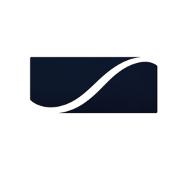

<div align="center">



# Endless Story

**An engine for persistent, on-chain story worlds.** Characters here are living memory assets that grow over time, not static images you collect.

Built with the MemWal SDK on Walrus and owned through Sui NFTs. **Spring Snow Troupe (春雪社)** is the first *Saga* running on the engine, and the world this demo shows.

[](https://sui.io)
[](https://walrus.xyz)
[](https://spring-snow.231labs.xyz)

[**Live demo**](https://spring-snow.231labs.xyz) · [**Pitch**](#the-pitch) · [繁體中文](README.zh-TW.md)

</div>

> Hackathon project for **Sui Overflow 2026 · Walrus track**.

---

## The pitch

The full story, what Endless Story is, why Walrus and Sui, and how it works, lives in the pitch deck:

▶ **[View the pitch deck](https://htmlpreview.github.io/?https://github.com/231-Labs/endless-story/blob/main/pitch/endless-story-pitch-light-en.html)** &nbsp;·&nbsp; [中文版](https://htmlpreview.github.io/?https://github.com/231-Labs/endless-story/blob/main/pitch/endless-story-pitch-light.html)

The deck source lives in [`pitch/`](pitch/) and is self-contained (open the `.html` file directly).

---

## Run it locally

```bash
nvm use                                  # Node 23.7.0 (pinned in .nvmrc)
pnpm install
pnpm --filter @endless-story/web dev     # http://localhost:3000
```

Needs Sui testnet access plus Poe, OpenAI, and MemWal credentials. Then open `http://localhost:3000/admin/deploy` to deploy contracts and bootstrap a story preset.

---

## License

TBD. Built by **231 Labs** for Sui Overflow 2026, on [Walrus](https://walrus.xyz) + [Seal](https://github.com/MystenLabs/seal), the [MemWal SDK](https://memwal.ai), and [Sui](https://sui.io).
