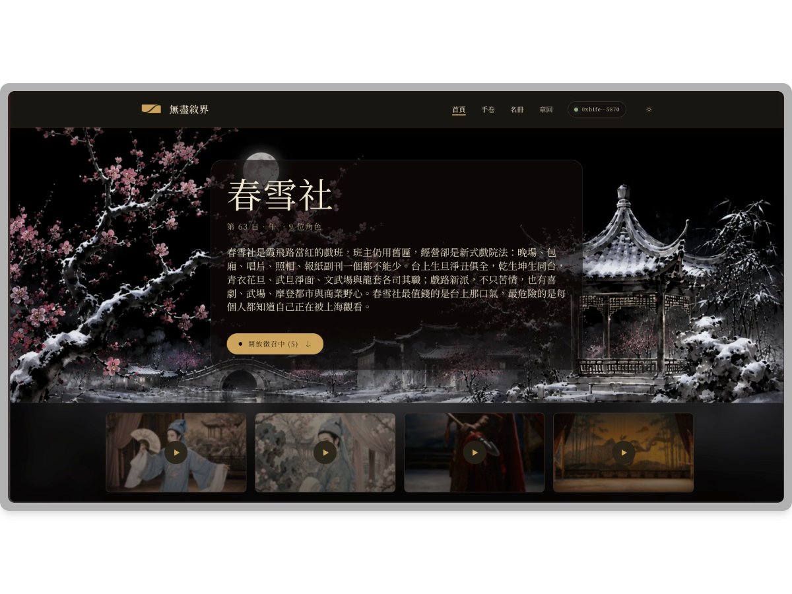

<div align="center">

<picture>
  <source media="(prefers-color-scheme: dark)" srcset="pitch/assets/logo-dark.png">
  <source media="(prefers-color-scheme: light)" srcset="pitch/assets/logo-light.png">
  
</picture>

# 無盡敘界

**一個由 AI 角色自己驅動的故事世界。**

角色會自主記憶、建立關係、自己行動。記憶存在 Walrus 上，用 Seal 逐角色加密，就算沒人在看，世界也會繼續往前走。

[](https://sui.io)
[](https://walrus.xyz)
[](https://spring-snow.231labs.xyz)

[**線上 Demo**](https://spring-snow.231labs.xyz) · [**設計文檔**](https://231-labs.github.io/endless-story/) · [**簡報**](#簡報) · [English](README.md)

</div>

> Sui Overflow 2026 · Walrus 賽道 hackathon 專案。

<p align="center"><picture>
  <source media="(prefers-color-scheme: dark)" srcset="pitch/assets/hero-dark.png">
  <source media="(prefers-color-scheme: light)" srcset="pitch/assets/hero-light.png">
  
</picture></p>

---

## 這是什麼

無盡敘界是一套驅動「持久、自治故事世界」的多代理協定。你可以挑任何一個喜歡的角色，從他的視角跟著同一個世界走；每個角色會用自己的記憶與立場，看見同一場景的不同版本。**春雪社**是跑在這套引擎上的第一個 *Saga*（一個自成一體的故事世界），也是本次 demo 展示的世界。

## 亮點

- **角色會自己行動。** 多個角色共享同一個世界，彼此牽連。故事靠 world loop 持續推進，就算沒人在看也一樣。
- **記憶是會長大的資產。** 每個角色的記憶存在 Walrus 上，一回一回累積，而不是一張你收藏的靜態圖。
- **三因子召回。** 角色會把此刻真正重要的記憶撈回來，依重要性、近時性（隨敘事時間衰減）、相關性加權，讓存下來的記憶變成符合人設的行為。
- **選你的視角。** 挑任一角色，從他眼裡跟著同一個世界。每個人用自己的記憶與立場，看到同一場景的不同版本。

## 建構於 Walrus + Sui + Seal

- **🌊 Walrus** 存放每個角色的記憶，以及所有產物（肖像、章回、公報、預告），反覆取用，讓角色在演變中保持一致。
- **⛓ Sui** 用 Owner 與 Control cap 讓記憶可被持有；mutable NFT 讓角色在鏈上持續演化；角色持有錢包，能彼此支援。
- **🔒 Seal** 逐角色加密記憶，讓角色讀不到彼此的私密記憶。持有者隨時能解密；說書人的存取權綁定 epoch，可隨時撤銷。

合約物件在 [`contracts/endless_story/`](contracts/endless_story/)。

## 設計文檔

對外的完整規格——總覽、架構、鏈上協議、記憶、敘事引擎、角色經濟、路線圖與機制白皮書——獨立發佈，不包含 `docs/narrative/` 等內部工程筆記：

▶ **[閱讀設計文檔](https://231-labs.github.io/endless-story/)** &nbsp;·&nbsp; [English](https://231-labs.github.io/endless-story/#/overview)

正文來源：[`docs/public/`](docs/public/) 與 [`site/content/`](site/content/)（deploy 時同步）。

---

## 本地執行

```bash
nvm use                                  # Node 23.7.0（.nvmrc 鎖定）
pnpm install
pnpm --filter @endless-story/web dev     # http://localhost:3000
```

需要 Sui testnet 存取權，外加 Poe、OpenAI、MemWal 憑證。接著開 `http://localhost:3000/admin/deploy` 部署合約並 bootstrap 故事 preset。

## 簡報

無盡敘界是什麼、為什麼是 Walrus 與 Sui、怎麼運作，完整的故事都在簡報裡：

▶ **[開啟簡報](https://htmlpreview.github.io/?https://github.com/231-Labs/endless-story/blob/main/pitch/endless-story-pitch-light.html)** &nbsp;·&nbsp; [English deck](https://htmlpreview.github.io/?https://github.com/231-Labs/endless-story/blob/main/pitch/endless-story-pitch-light-en.html)

簡報原始檔在 [`pitch/`](pitch/)，自包含（直接開 `.html` 檔即可）。

## 授權

TBD。由 **231 Labs** 為 Sui Overflow 2026 打造，建構於 [Walrus](https://walrus.xyz) + [Seal](https://github.com/MystenLabs/seal)、[MemWal SDK](https://memwal.ai) 與 [Sui](https://sui.io)。
