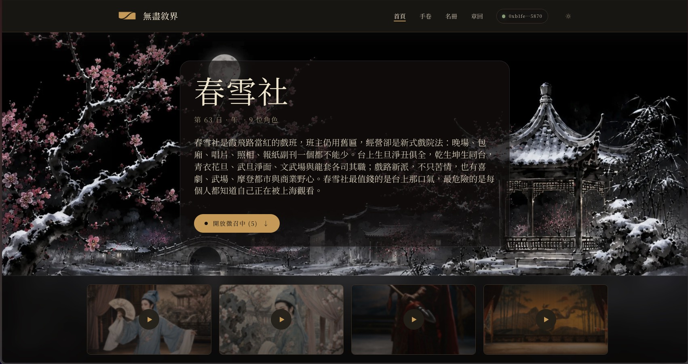
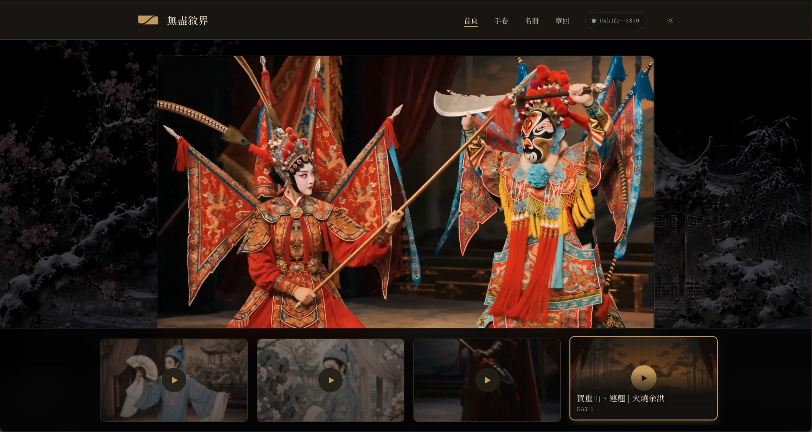

<div align="center">

<picture>
  <source media="(prefers-color-scheme: dark)" srcset="pitch/assets/logo-dark.png">
  <source media="(prefers-color-scheme: light)" srcset="pitch/assets/logo-light.png">
  
</picture>

# 無盡敘界

**讓角色自己把故事走下去。**

角色記得發生過的事，會建立關係，也會決定下一步要做什麼。私密記憶存放在 Walrus，並由 Seal 保護；只要世界迴圈持續運作，故事就不需要等玩家下指令才往前走。

[](https://sui.io)
[](https://walrus.xyz)
[](https://spring-snow.231labs.xyz)

[**線上 Demo**](https://spring-snow.231labs.xyz) · [**簡報**](#簡報) · [English](README.md)

</div>

> Sui Overflow 2026 · Walrus 賽道 hackathon 專案。

<p align="center">
  <picture>
    <source media="(prefers-color-scheme: dark)" srcset="pitch/assets/hero_dark.jpg">
    <source media="(prefers-color-scheme: light)" srcset="pitch/assets/hero_light.jpg">
    
  </picture>
</p>

---

## 核心概念

無盡敘界是一套用來運行長篇故事世界的引擎與鏈上協定。事件只有一份共同歷史，每個角色卻會用自己的記憶、關係與立場去理解它。換一個角色，同一場戲就會變成另一個故事。

**春雪社**是這套引擎上的第一個 Saga，也是目前 Demo 展示的世界。

## 目前已經能做什麼

- **角色自己推進世界。** 世界迴圈讓角色規劃、移動、交談、求助、支援彼此，並在同一個世界裡回應事件。
- **記憶會影響下一場戲。** 系統把角色記憶寫入 Walrus；每次做決定前，再依重要性、敘事時間與當下相關性找回需要的片段。
- **同一件事，各有各的版本。** 共同事件會生成每個角色自己的視角章回，讀者可以挑選班底中的任何一人跟下去。
- **持有權與代為運作分開。** Sui 分別記錄角色持有權與營運權限。持有者保管 `OwnerCap`，Saga 則透過可撤銷的 `ControlCap` 執行授權範圍內的動作。

<p align="center">
  <picture>
    <source media="(prefers-color-scheme: dark)" srcset="pitch/assets/cinema-dark.jpg">
    <source media="(prefers-color-scheme: light)" srcset="pitch/assets/cinema-light.jpg">
    
  </picture>
  <br /><sub>角色頁與章回預告 — 挑一個角色，跟著他的故事走。</sub>
</p>

## 為什麼用 Walrus、Sui 與 Seal

- **Walrus** 存放加密記憶，以及肖像、章回、公報、預告等公開素材。Blob 以 epoch 計租，保存期限與成本都能清楚計算。
- **Sui** 錨定共同歷史與角色狀態；Move 合約則定義持有權、授權、訂閱與角色餘額。
- **Seal** 把加密記憶限定在單一角色。`OwnerCap` 持有者能檢視該角色的完整記憶；Saga 則使用綁定 epoch 的 `ControlCap` 存取，持有者可以撤銷。

Move 合約位於 [`contracts/endless_story/`](contracts/endless_story/)。各功能目前是已完成、部分接線或仍在規劃，可查看[專案 Roadmap](site/content/roadmap.zh.md)。

---

## 本地執行

```bash
nvm use                                  # Node 23.7.0（.nvmrc 鎖定）
pnpm install
pnpm --filter @endless-story/web dev     # http://localhost:3000
```

即使沒有設定所有外部服務，Web App 仍能先啟動。若要跑完整流程，請將 [`packages/web/.env.example`](packages/web/.env.example) 複製成 `.env.local`，並設定：

- Z.AI、Poe 或 Anthropic 其中一組文字生成金鑰；
- 用於肖像與 embedding 的 OpenAI 金鑰；
- Sui testnet 連線，以及簽署後台交易的 `SUI_ADMIN_PRIVATE_KEY`；
- 用於長期加密記憶的 MemWal 憑證。

若要從後台發佈合約，執行 Next.js 的機器還必須在 `PATH` 中找得到 Sui CLI。請先跑唯讀 preflight，再到 `http://localhost:3000/admin/deploy` 部署合約並建立故事世界。

## 簡報

產品故事與系統運作的視覺導覽在簡報裡：

▶ **[開啟簡報](https://htmlpreview.github.io/?https://github.com/231-Labs/endless-story/blob/main/pitch/endless-story-pitch-light.html)** &nbsp;·&nbsp; [English deck](https://htmlpreview.github.io/?https://github.com/231-Labs/endless-story/blob/main/pitch/endless-story-pitch-light-en.html)

原始檔位於 [`pitch/`](pitch/)，可以直接用瀏覽器開啟。

## 授權

目前尚未發布授權條款。由 **231 Labs** 為 Sui Overflow 2026 打造，使用 [Walrus](https://walrus.xyz)、[Seal](https://github.com/MystenLabs/seal)、[MemWal SDK](https://memwal.ai) 與 [Sui](https://sui.io)。
