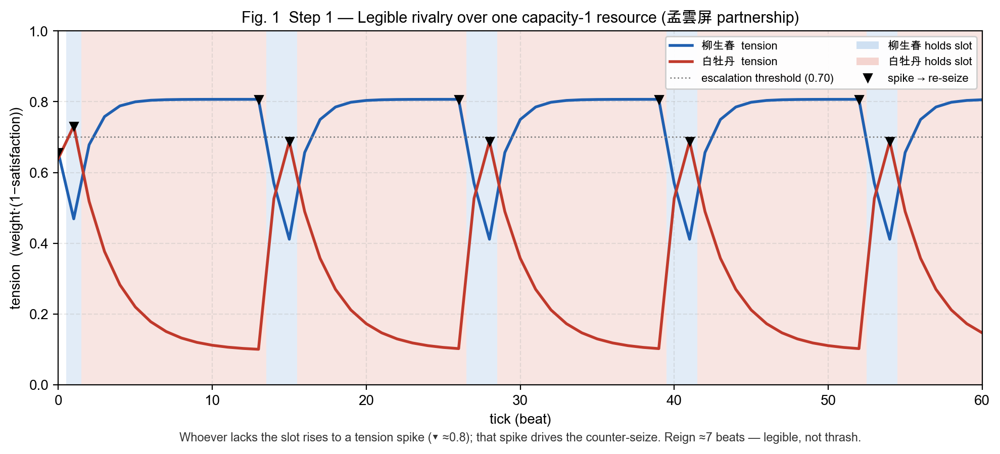
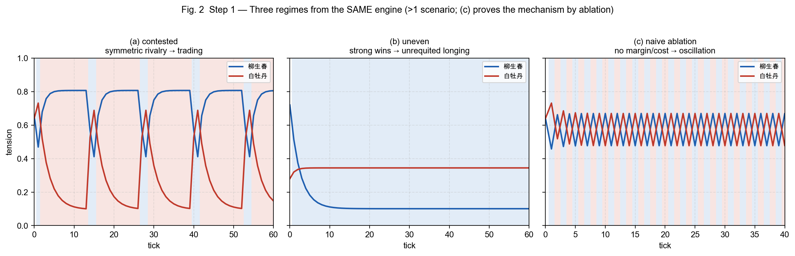
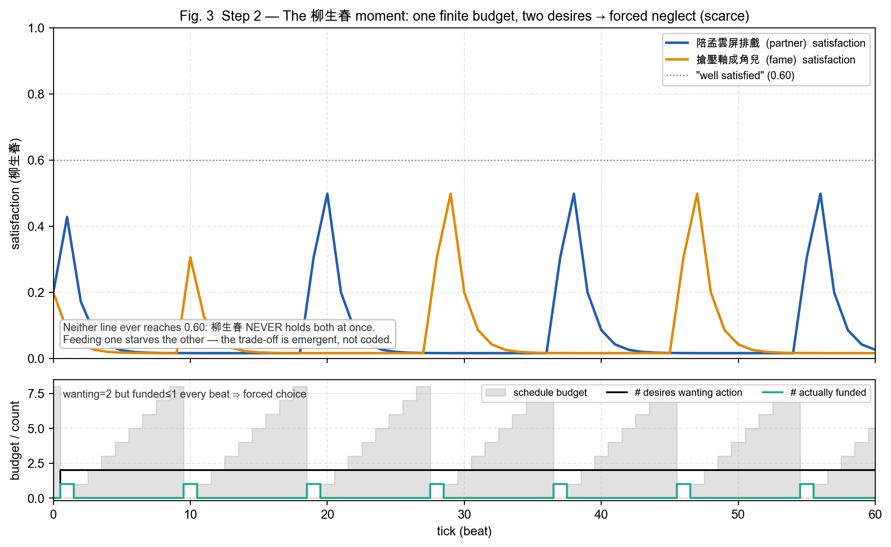
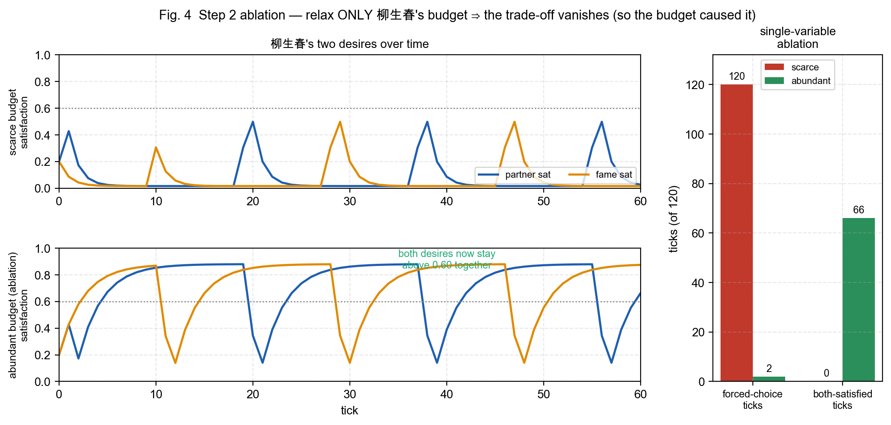

# Drama Engine — Stage 1 (Step 0–2) Calibration & Tension-Curve Writeup

> Pure offline deterministic core + simulator for the **Desire/Resource Drama Engine**.
> This is the paper-eval seed (spec §9 Stage 2) and the calibration record for the port-back.
> Scope: spec §2 primitives + §3 `applyTick` + an offline driver. **No LLM, no chain, no UI.**

All numbers below are reproduced byte-for-byte by `node driver/report.ts` (deterministic).

---

## 1. What was built

| Layer | File(s) | What it is |
|---|---|---|
| Fixed-point math | `src/fixed.ts` | `SCALE=1_000_000`, `bigint` (= Move u64/u128), truncating `mulScale`/`mulDiv` |
| 3 primitives | `src/types.ts` | `Desire` / `Resource` / `Action` (+ `WorldState`, `TuningConfig`) |
| The transition | `src/applyTick.ts` | pure `applyTick(world, actions, cfg) → world` |
| Derived tension | `src/tension.ts` | `tension = weight·(SCALE−s)/SCALE`, never stored |
| Offline driver | `driver/` | margin-hysteresis planner, tick loop, failure-mode metrics, `cli.ts` demo |
| Scenarios | `scenarios/` | partnership (Step 1) + fame (Step 2) fixtures |
| Tests | `test/` | 26 tests: conservation, bounded-without-clamp, determinism, golden vectors, failure modes, the 柳生春 trade-off |

`applyTick` phase order: **REFILL → RESOURCE → SATISFACTION → (tension derived on read)**.

---

## 2. Decisions taken (to confirm at port-back review)

These resolve points the spec left open (spec §11) or under-specified; each is flagged so the
main session can ratify or change them. They do **not** contradict the brief's locked decisions
(§3) — they implement them.

1. **`bigint`, not `number`.** The spec's interfaces show `number`, but float64 cannot hold
   u128 intermediates and float rounding isn't cross-engine identical — both break the
   "re-run reproduces the exact next state byte-for-byte" guarantee. Every domain value and
   intermediate is `bigint`, which maps 1:1 onto Move u64/u128 and matches Sui's JSON u64
   encoding. **This is the load-bearing choice for on-chain verifiability.**

2. **Refill lives *inside* `applyTick`** (a REFILL phase), not in the driver. The locked
   decision is "fixed per-tick refill"; putting it in the pure transition means re-running
   `applyTick` alone reproduces budget state too, so the whole transition stays verifiable.
   Modelled as an optional `Resource.refill = {to, amount}`, capped at free capacity so it can
   never break conservation. Refill runs **before** actions so an agent spends *this* tick's
   budget.

3. **Tuning is threaded, not hardcoded.** `alphaUp/alphaDown/gamma` are a `TuningConfig`
   argument to `applyTick` (SCALE stays a module const). Required so the simulator can run
   >1 scenario and Stage-2 sweeps; this config is part of the committed transition.

4. **Per-agent budget = its own sole-holder `Resource`** (`schedule:<agent>`, capacity = max
   budget). One agent spending never frees another's capacity. The action `cost` debits it.

5. **Goal persistence + budgeting live in the Planner, never in the transition** (brief §3.2).
   The pure `applyTick` is pure mechanism; *who acts and on what* is the driver's job.

6. **Bounded-without-clamp** is achieved by truncating-toward-zero integer division on convex
   moves: `s += rate·(target−s)/SCALE` with `rate ≤ SCALE` never overshoots `target`, and the
   habituation step `+= gamma·(baseline−s)/SCALE` likewise can't cross `baseline`. So with all
   tuning knobs in `[0,SCALE]`, `s` provably stays in `[0,SCALE]` with **no `clamp` anywhere**
   (asserted by a 400-tick adversarial sweep over edge tunings in `test/core.test.ts`).

7. **`want == 0 ⇒ target = SCALE`** (a desire that wants nothing is vacuously satisfied;
   avoids div-by-zero). **Canonical action order** = sort by `(actor, input-index)` using raw
   codepoint comparison (not `localeCompare`, which isn't cross-machine stable).

---

## 3. Calibrated parameters

**Satisfaction dynamics (shared by all scenarios):**

```
SCALE      = 1_000_000
alphaUp    =   300_000   (0.30)   gains relax slowly
alphaDown  =   600_000   (0.60)   losses relax fast   → loss aversion (alphaDown > alphaUp) ✓
gamma      =    50_000   (0.05)   mild habituation     → no flatline-of-success
baseline   =   200_000   (0.20)   per-desire anchor
volatility = 1_000_000   (1.00)   full relaxation rate
```

**Planner / budget (the behavioural knobs):**

```
seizeMargin  = 0.12   challenger must out-tense the holder by this to seize
focusMargin  = 0.15   committed focus only yields if a rival desire beats it by this (anti-thrash)
actThreshold = 0.30   below this tension an agent is "content enough" to do nothing
actionCost   = budgetCap   (a seize spends ~a full budget; refill 1/tick sets the flip period)
```

The single most important calibration insight: **the action-budget refill rate sets the
flip period.** With `actionCost == budgetCap` and `refill = 1/tick`, a performer can only
re-seize a contested slot roughly every `budgetCap` ticks. That converts what would be
per-tick `argmax` thrash into a slow, legible rivalry. `budgetCap = 12` gives a reign period
of ~7 ticks — long enough for the holder to savour the slot and the loser to stew to a
visible tension spike before reclaiming it.

---

## 4. Failure modes — defined, then asserted (spec §8)

The metrics in `driver/metrics.ts` operationalize the three failure modes so tests assert
numbers, not vibes:

- **flatline** — max peak-to-trough tension swing on a contested desire `< 0.15`.
- **runaway** — late-window mean satisfaction (all desires) `< 0.08` (despair attractor).
- **oscillation** — *frequency-based*: late-window holder **reign period `< 4` ticks** AND
  `≥ 3` late flips. This is the key refinement: a symmetric rivalry that trades the role every
  ~8 beats is **legible drama**, not thrash; only the degenerate near-period-1 flip is
  pathological. A naive flip-*count* threshold wrongly condemns healthy rivalry.

---

## 5. Results

### Step 1 — partnership (cross-agent, capacity-1 孟雲屏 slot)

```
scenario                      flat run osc  totFlips lateFlips reignP  esc  swing  lateSat
partnership-contested           .    .   .      16        6     6.8   Y   0.631  0.386
partnership-uneven              .    .   .       1        0   inf    Y   0.619  0.452
partnership-naive-ablation      .    .   Y      80       32     1.0   Y   0.254  0.284
```

- **contested** — near-symmetric rivals (柳生春 0.82 / 白牡丹 0.80). The slot changes hands on
  a legible ~7-tick rhythm (reign period 6.8); every reclaim is a **legible escalation**
  (`esc=Y`): the loser's tension climbs to ~0.81 and *that spike* drives the counter-seize.
  None of the three failure modes. This is the headline "drama lives on the edge" beat.
- **uneven** — 柳生春 wants it far more (0.90 vs 0.35) and the seize margin is raised to 0.50.
  柳生春 takes the slot once and keeps it; 白牡丹 can never clear holder+margin → settles into
  **unrequited longing** (白牡丹 ends at sat ≈ 0.02, tension ≈ 0.34, never satisfied, never
  flipping). The big swing (0.62) comes from 柳生春's opening climb out of frustration.
- **naive ablation** (negative control) — strip the seize margin (0) and the budget cost (0).
  Oscillation **reappears** (`osc=Y`, reign period 1.2): the holder flips almost every tick.
  This is the proof that the margin + finite budget are load-bearing, not decoration.

Tension-curve shape (contested, one period), satisfaction `s` of the slot-holder vs the loser:

```
holder:  s climbs 0.20→0.35→…→0.53  (savouring)     tension falls 0.66→0.39
loser :  s decays 0.20→0.17→…→0.08  (starved)       tension rises 0.64→0.76 ──┐
                                                                               └─ spike drives the re-seize → roles swap
```

### Step 2 — fame (intra-agent trade-off, the 柳生春 moment)

柳生春 carries **two** desires — `partner` (陪孟雲屏排戲, draws from `partnership:孟雲屏`) and
`fame` (搶壓軸, draws from `spotlight:壓軸`) — both funded from its **one** finite schedule
budget. 白牡丹 is a fixed rival that keeps poaching both slots, so 柳生春 must keep re-seizing.
Metrics are for 柳生春:

```
scenario           flat run osc  forcedChoice focusSwitch bothHigh maxNeglect
fame-scarce          .    .   .          120          14        0        120
fame-abundant        .    .   .            2          13       66          4
```

- **scarce** (budget cap 8, refill 1) — 柳生春 can fund **one** pursuit per cycle. With both
  desires clamouring it is **forced to choose on every one of the 120 ticks** (`forcedChoice=120`),
  its focus **alternates 14 times** between 陪孟雲屏 and 搶壓軸, and it **never once** holds both
  slots satisfied (`bothHigh=0`); its longest unbroken neglect run spans the whole horizon. The
  neglected ambition's satisfaction slides every time. This torn, oscillating attention **is**
  the 柳生春 moment — nothing in the code declares it; it falls out of the budget being finite.
- **abundant** (ablation: only 柳生春's budget raised to cap 64 / refill 64; **白牡丹 unchanged**)
  — now 柳生春 funds **both** desires, out-competes 白牡丹, and holds both slots satisfied for
  **66/120** ticks. `forcedChoice` collapses **120 → 2** (just a warm-up transient before the
  budget builds) and `maxNeglect` **120 → 4**. The single changed variable is the budget, so
  **the budget is provably the cause** of the trade-off. (`focusSwitches` stays ~13 — that is
  mere attention *relabelling* as the two tensions cross while it funds both; the trade-off
  itself is about *funding*, which `forcedChoice`/`bothHigh` track and which vanishes.) An
  *authored* trade-off would have survived this ablation; this one does not.

> Design finding worth carrying to the paper: the intra-agent trade-off is only *live* under
> ongoing cross-agent contention. Holding a slot is free once acquired (cost is paid only to
> acquire/seize), so without a poaching rival 柳生春 would simply grab both and rest. The
> trade-off is precisely *"I must re-seize BOTH every cycle but can only afford ONE."* The two
> conflict types from spec §4 are therefore coupled, not independent — a small but real result.

### Figures (plotted from real engine traces; see [`figures/`](figures/README.md))

**Fig. 1 — Step 1, legible rivalry.** Tension time series of both performers over the 孟雲屏
slot; background bands show who holds it; ▼ marks each spike-driven re-seize.



The two tensions are a see-saw (zero-sum): whoever lacks the slot rises to a ~0.8 spike, and
*that* spike drives the counter-seize. A reign lasts ~7 beats — legible drama, not thrash.

**Fig. 2 — Step 1, three regimes from the same engine** (anti-overfit + ablation). (a)
symmetric trading; (b) the stronger desire wins and holds → the loser settles into unrequited
longing (flat ~0.34 line); (c) the negative control — strip margin + budget cost and
oscillation reappears.



**Fig. 3 — Step 2, the 柳生春 moment.** Top: 柳生春's two desires' satisfaction; neither ever
crosses the 0.60 "well satisfied" line — feeding one starves the other. Bottom: the budget,
and `wanting=2` vs `funded≤1` every beat (the scarcity that forces the choice).



**Fig. 4 — Step 2, single-variable ablation.** Relax only 柳生春's budget (everything else
fixed): the two desires now stay jointly above 0.60, and the discriminator metrics collapse
(forced-choice 120→2, both-satisfied 0→66). The budget is provably the cause.



---

## 6. Definition-of-Done checklist (brief §4)

- [x] Step 0 green — 3 primitives + `applyTick`; conservation / bounded-without-clamp /
      determinism / golden vector (10 tests).
- [x] Step 1 green — 2 agents, 1 capacity-1 resource, legible escalation, tension tracks
      allocation, no flatline/runaway/oscillation.
- [x] **>1 scenario** — contested, uneven, naive-ablation (Step 1) + scarce, abundant (Step 2).
- [x] **柳生春 trade-off emerges** (not scripted) and is proven budget-caused by ablation.
- [x] **All three failure modes absent** in the intended scenarios; reproduced on purpose in
      the negative control.
- [x] `tsc --noEmit` clean; **26/26 tests** green (`npm test` / glob; bare `node --test` shows 27 because it also counts `test/helpers.ts`).
- [x] Golden vector committed (`test/core.test.ts`) = the on-chain "re-run to verify" reference.

---

## 7. Port-back notes for the main session

- **Copy `packages/drama/` as-is.** Zero deps; imports nothing from web/runner/sdk/llm/
  memwal/shared. (The worktree has no `node_modules`; tests run on Node ≥ 22 via
  `node --test` native TS type-stripping, and `tsc` is borrowed from the repo root — see §8.)
- **The pure module to wire is `src/index.ts`'s `applyTick`.** The driver/scenarios are the
  simulator and the paper-eval seed; the product would replace the *planner* (its
  `decideCardPlay`/`decideMove` become "propose an `Action`") but **import the same
  `applyTick`** — never reimplement the transition.
- **Step 3 (LLM boundary)** plugs in where the planner proposes actions: ambiguous social
  events become a discretized `{resource_id, direction, level, justify_refs}` → a fixed nudge;
  the resource phase still validates. **Not done here, by scope.**
- **Step 4 (on-chain)**: `Resource` → a Move resource type; conservation = a linear-type
  invariant; the golden vector is the re-run reference. The `bigint` arithmetic is already
  Move-shaped.
- **Open items to ratify:** the seven decisions in §2 (esp. `bigint`, refill-in-transition,
  and the frequency-based oscillation metric).

---

## 8. How to run

```bash
cd packages/drama
npm test                                   # 26 tests (glob test/**/*.test.ts)
node --test                                # also works; shows 27 (also counts test/helpers.ts)
node driver/cli.ts partnership-contested   # legible-rivalry trace + analysis
node driver/cli.ts fame-scarce             # the 柳生春 trade-off
node driver/report.ts                      # the tables in §5
# regenerate the figures (needs python3 + matplotlib + numpy + a CJK font):
node driver/export-traces.ts > figures/traces.json && python3 figures/plot.py
# type-check (borrows the repo-root TypeScript; worktree has no node_modules):
node ../../node_modules/typescript/bin/tsc --noEmit -p tsconfig.json
```

> Note on the test runner: this repo's Node treats `node --test <dir>` as "run the file
> `<dir>`", not "discover in `<dir>`". Use bare `node --test` (or the glob the npm script uses).
